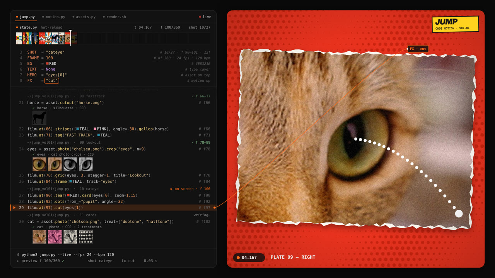
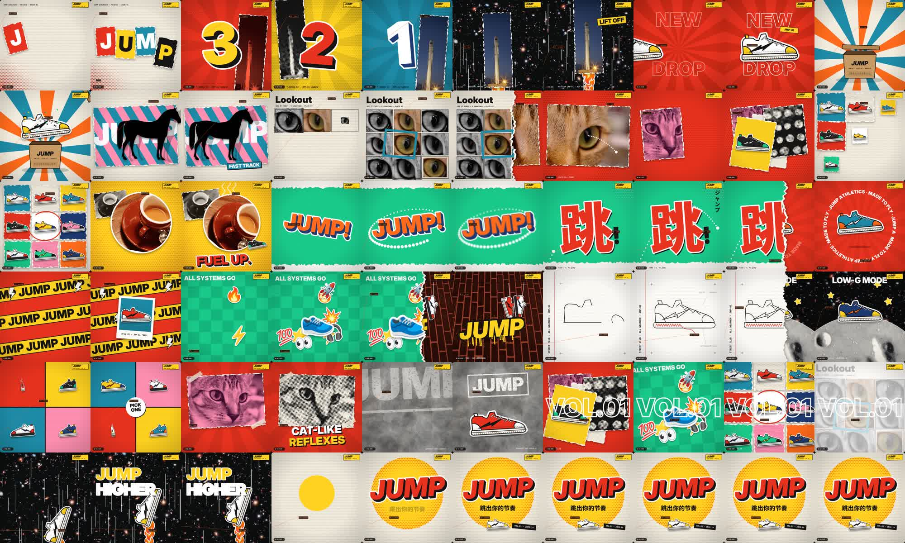

# collage-code-motion

**用代码写一整条拼贴风快切动效短片。** 撕纸、半调网点、照片拼贴、emoji 贴纸、立体大字、与切点对齐的节拍音轨，全部由一个 HTML Canvas 程序逐帧生成，输出 MP4。每一个字体、时间点、运镜都是参数，哪里不满意就改哪里。

这是一个 [Claude Skill](https://docs.claude.com/en/docs/agents-and-tools/agent-skills/overview)：装好以后，你只管当艺术总监（说方向、给素材、提修改），Claude 负责写分镜、写代码、渲染、修改。



> 示例成片（15 秒，27 个镜头，120 BPM）：[`docs/jump-vol01-preview.mp4`](docs/jump-vol01-preview.mp4)
>
> 

## 特点

- **两种布局**：`showcase` 是 1920×1080，左边代码面板会实时打字、高亮当前行、连线到画面，右边是成片；`film` 是 1080×1080 纯成片。
- **12 个预设镜头**，文字和主角都可以替换，另外有一整套拼贴工具函数（撕纸照片卡、贴纸、胶带、光芒、网点、立体字、倒数……）。
- **素材处理脚本**：任意照片或 AI 生成图，一条命令转成彩色、黑白、半调、双色调、圆形贴纸、去底、剪影。
- **自动配乐**：根据时间线合成鼓点、贝斯、切点音效和转场 whoosh。
- **确定性渲染**：同样的代码，每次渲染出来的每一帧都一样，方便来回修改、对比。

## 安装

```bash
git clone <this repo> collage-code-motion && cd collage-code-motion
npm install && npx playwright install chromium
pip install numpy pillow        # 还需要 ffmpeg
```

**作为 Claude Skill 使用**：把整个文件夹放进 skills 目录（比如 Claude Code 的 `~/.claude/skills/collage-code-motion/`），或者在 claude.ai 的 Skills 设置里上传 zip。之后直接对 Claude 说："用 collage-code-motion 给我的咖啡品牌 BREW 做一条 15 秒的拼贴动效，素材是这几张图。"

## 手动使用

```bash
npm run example                                   # 渲染完整示例 → examples/jump-vol01/out.mp4
cp -r template projects/mybrand                   # 新建项目
python3 scripts/prep_assets.py photo.jpg --out projects/mybrand/assets --name hero --treat color duotone:#2a0a12:#FF8FB1 halftone
bash scripts/preview.sh projects/mybrand "6,20,44"   # 抽帧检查
bash scripts/make_video.sh projects/mybrand          # 出片
```

想在浏览器里实时预览，可以在项目目录跑 `python3 -m http.server`，然后打开 `index.html`（先跑一次 `build.py` 生成它）。

## 项目结构

```
engine/       core.js · presets.js · engine.js      引擎（一般不用改）
scripts/      build / render / audio / prep_assets / preview / make_video
template/     起手项目：config.js + timeline.js
examples/     jump-vol01 完整示例（含 CC0 素材）
references/   api.md · shot-grammar.md · assets.md
SKILL.md      给 Claude 的工作流程说明
```

## 授权

代码使用 MIT 协议。示例图片来自 scikit-image 样图（CC0 / 公有领域），详见 `references/assets.md`。emoji 在运行时由系统字体渲染，仓库里不包含 emoji 图片。
